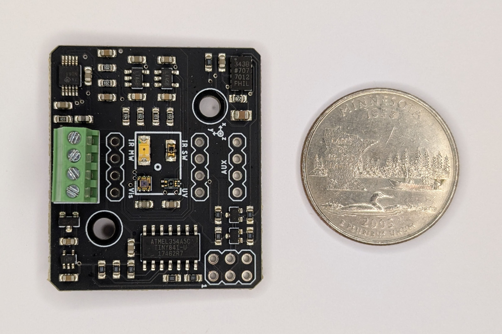

# Project-Libelle

*Libelle* is a spectrally-resolving shortwave pyranometer that measures solar irradiance across six spectral bands from UV-B through short-wave infrared (~280–1700 nm). The name is German for both "dragonfly" — an organism with up to 30 types of photoreceptors spanning UV to near-IR — and "spirit level," a nod to the onboard accelerometer used to correct measurements for sensor tilt.



## Measurements

| Channel | Sensor | Approx. range |
|---------|--------|---------------|
| UV-B | VEML6075 | ~280–315 nm |
| UV-A | VEML6075 | ~315–400 nm |
| Visible (ALS) | VEML6030 | ~400–700 nm |
| White (broadband) | VEML6030 | ~300–700 nm |
| Near-IR (short) | VEMD1060X01 | ~700–1100 nm |
| Near-IR (mid) | SD003-151-001 | ~1000–1700 nm |
| Temperature | NTC thermistor | — |
| Tilt (roll + pitch) | ADXL343 | — |

Spectral response curves for each channel are in [`Analysis/SpectrumResponsePlots/`](Analysis/SpectrumResponsePlots/).

## Hardware

The board integrates its sub-sensors through an ATtiny841, which aggregates their readings and presents a single I²C slave interface to the host. The host never addresses the sub-sensors directly.

**Key ICs:** VEML6075 (UV), VEML6030 (visible/lux), VEMD1060X01 + SD003-151-001 (NIR photodiodes), ADS1115 (16-bit ADC), ADXL343 (accelerometer), ATtiny841 (I²C bridge), TPS79733 (3.3 V LDO)

### Net radiation

Two Libelle modules can share a single I²C bus simultaneously — one facing skyward (UP) and one facing down (DOWN) — to compute net shortwave radiation (↓ − ↑). The I²C address is set by solder jumper J1:

| Orientation | Address |
|-------------|---------|
| Up (default, J1 open) | `0x40` |
| Down (J1 bridged) | `0x41` |

## Electrical

- **Supply:** 3.3–5 V (onboard 3.3 V LDO; I²C lines are level-shifted to match host supply)
- **Interface:** I²C (slave)
- **Connectors:** 4-pin screw terminal (J1) and 4-pin headers (J2–J4); ISP header for ATtiny firmware updates (ISP1)

### External connector pinout

| Pin | Function |
|-----|----------|
| VIN | Supply (3.3–5 V) |
| GND | Ground |
| SDA | I²C data |
| SCL | I²C clock |

### Interrupt / auxiliary pins

| Pin | Function |
|-----|----------|
| D0 | Lux interrupt (active low) |
| D1 | ADC interrupt (active low) |
| D7 | Address select (pull low → `0x41`) |

## Software

Install the [Libelle Arduino library](https://github.com/NorthernWidget-Skunkworks/Libelle_Library) from the Arduino Library Manager or by cloning the repository.

### Quick start

```cpp
#include <Libelle.h>

Libelle pyroUp(UP);

void setup() {
    Serial.begin(38400);
    pyroUp.begin();
    Serial.println(pyroUp.getHeader());
}

void loop() {
    Serial.println(pyroUp.getString());
    delay(1000);
}
```

For a net radiation setup with two modules:

```cpp
Libelle pyroUp(UP);
Libelle pyroDown(DOWN);
```

### Key API methods

| Method | Returns | Description |
|--------|---------|-------------|
| `begin()` | `bool` | Initialize; returns `false` if bridge or accelerometer unreachable |
| `getHeader()` | `String` | Comma-separated column names with units |
| `getString()` | `String` | Comma-separated measurement values |
| `getUVA()` | `long` | UV-A raw counts |
| `getUVB()` | `long` | UV-B raw counts |
| `getLux()` | `float` | Illuminance (lux) |
| `getIR_Short()` | `float` | NIR ~700–1100 nm, TIA output voltage (V) |
| `getIR_Mid()` | `float` | NIR ~1000–1700 nm, TIA output voltage (V) |
| `getTemp()` | `float` | Housing temperature (°C) |
| `getRoll()` | `float` | Roll angle (°) |
| `getPitch()` | `float` | Pitch angle (°) |

`getIR_Short()` and `getIR_Mid()` return transimpedance amplifier output voltage, not W/m². Converting to irradiance requires calibration against a reference pyranometer; see the [library documentation](https://github.com/NorthernWidget-Skunkworks/Libelle_Library) for details.

## Mechanical

CNC-millable mounting hardware designs are available on [Easel (Inventables)](https://www.inventables.com/):

- [Pipe mount](https://easel.inventables.com/projects/cAirZefIUws53oghGYYopw) — accepts 1.25"–3.25" ID pipe with 1/4" U-bolts (common US sizes: 1.25", 1.5", 1.75", 2")
- [Drilling jig](https://easel.inventables.com/projects/s-fOn9DWTmkeizO0vO8MGw) — for the Libelle enclosure box

SolidWorks source files and STLs are in [`Mechanical/`](Mechanical/).

## Related projects

- [Project-Liasis](https://github.com/NorthernWidget-Skunkworks/Project-Liasis) — companion longwave (thermal IR) pyrgeometer
- [Liasis Library](https://github.com/NorthernWidget-Skunkworks/Liasis_Library) — Arduino library for the Liasis pyrgeometer

## License

Hardware: <a rel="license" href="http://creativecommons.org/licenses/by-sa/4.0/"></a> <a rel="license" href="http://creativecommons.org/licenses/by-sa/4.0/">Creative Commons Attribution-ShareAlike 4.0 International</a>

Firmware: [GNU General Public License v3](LICENSE_for_code)
